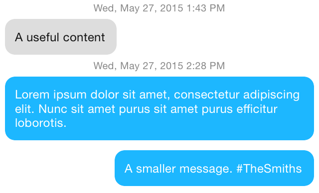

## Chat Message Builders Factory
This widget is extremely linked to [ts.chat widget][tschat]
as it gives a way to generate builders for the chat widget.
In this way, the chat widget could **delegate** the rendering to an external component and focus on
its other concerns. Following a MVC pattern, the chat widget represents the main controller which
knows how to handle differents views; However, it doesn't know hot to display a single view; This is
the role of builders.

Detailed documentation can be found here : [documentation][doc]

### Builders 
Builders are simple **Alloy controllers** that should export one unique method `build`; This method
will be used to transform a Message object into a view. The real type of the messsage object depends
on what kind of model is used to represent it; To one kind of model, there is one builder. Both
are complementary.

#### Messenger-like 
There is for the moment only one builder supplied with the factory; This is the *messenger-like*
builder which look like this :

<div style="width=100%; text-align: center">

</div>

One supposed that the model is a **Backbone model** which gives access to at least an *author*, a
*content* and a *date*.

#### Custom builders
One may add an additional builders by following the required pattern (see MessageBuilder interface
in [documentation][ddoc]) and putting his file alongside
the factory (*widget.js*). Then, the builder will be available from the outside.

The factory is in charge of creating the final container which is a *TableViewRow* and supplies it
to all builders. A builder should only populate this container with formated data. In other words,
builder are kind of templates for the inner-content of a *TableViewRow*.

### How it works
From any app or widget which may used the [ts.chat widget][tschat], just get an instance of a
builder by using :

```javascript
    var msgBuilder = Alloy
        .createWidget('ts.messageBuilderFactory')
        .getBuilder(/*<builder-name>*/, {
            /* <builder-conf> ,
            ... */
        });

    // or, depending of the context

    var msgBuilder = Widget
        .createWidget('ts.messageBuilderFactory')
        .getBuilder(/*<builder-name>*/, {
            /* <builder-conf>,
            ... */
        });
```

Then, just supply the builder to the [ts.chat widget][tschat]

### TODO
- Create some other builders
- Add a *clean* function to the factory and the existing builders
- Write some tests on the test branch


[tschat]: https://github.com/thesmiths-widgets/ts.chat
[doc]: https://thesmiths-widgets/ts.messageBuilderFactory
